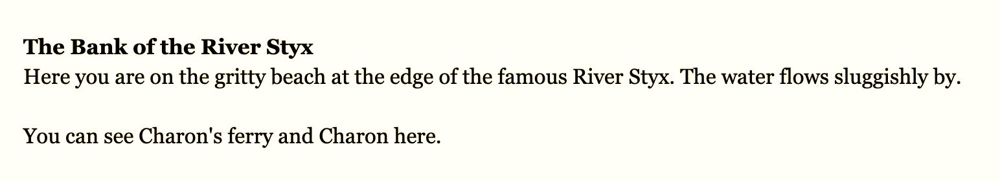

# Let's Play: Ancient Greek Punishment: The Text Adventure



# [Play Online](https://pippinbarr.github.io/lets-play-ancient-greek-punishment-the-text-adventure)

## Description
```
> get punishment
```

## Press
The [press kit](../press) has details about the creation of the game and press information.

## Documentation
* Read the [process documentation](../process/) to learn about the process of creating the game
* Read the [Commit History](https://github.com/pippinbarr/lets-play-ancient-greek-punishment-the-text-adventure/commits/master) for step-by-step information about how the project was built
* Look at the [Code Repository](https://github.com/pippinbarr/lets-play-ancient-greek-punishment-the-text-adventure) for source code etc.

## License
Made in the [Technoculture, Art, and Games (TAG) Research Centre](http://tag.hexagram.ca/).  
Made in the [Milieux Institute for Arts, Culture, and Technology](http://milieux.concordia.ca/).
